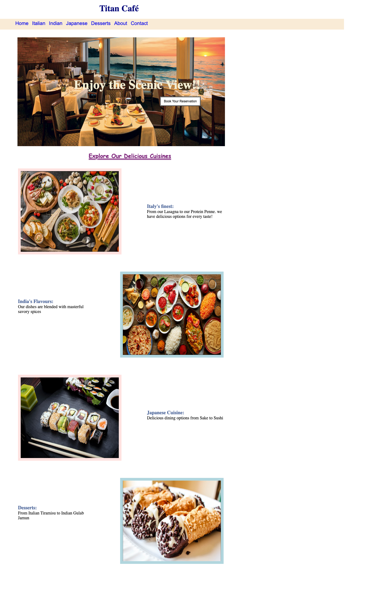

# Titan Café

A simple static restaurant landing page built with plain HTML and CSS.

## What It Is

Titan Café is a single-page static website for a fictional multi-cuisine
restaurant. It presents a hero banner, a navigation bar, and a showcase of the
café's cuisine categories with images and short descriptions. There is no
backend, build step, or JavaScript — it is pure HTML and CSS.

## Tech Stack

- HTML5
- CSS3 (external stylesheet, `style.css`)

## Pages & Sections

- **`home.html`** — the main page, containing:
  - Header with the "Titan Café" title
  - Navigation bar (Home, Italian, Indian, Japanese, Desserts, About, Contact)
  - Parallax hero section with a "Book Your Reservation" button
  - Cuisine showcase with four sections — Italian, Indian, Japanese, and
    Desserts — each with a bordered image and a short description
- **`welcome.html`** — a minimal placeholder page linked from the About and
  Contact navigation items
- **`Images/`** — the JPEG images used across the page (`main.jpeg`,
  `Italy.jpeg`, `india.jpeg`, `japan.jpeg`, `desserts.jpeg`)

## How to View

Since this is a static site, you can open it directly in a browser:

```bash
open home.html      # macOS
# or just double-click home.html in your file manager
```

Or serve it locally with Python's built-in HTTP server:

```bash
python3 -m http.server 8000
```

Then visit <http://localhost:8000/home.html> in your browser.

## Screenshots


